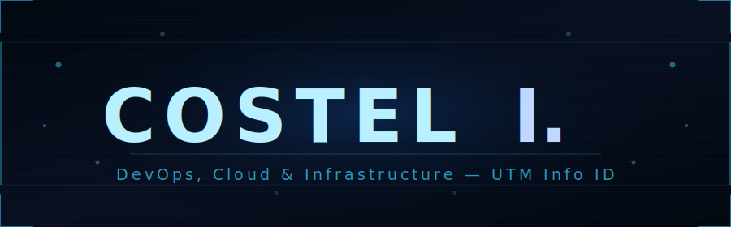

<div align="center">



<br/>

<a href="mailto:iacobcostel03@gmail.com">
  
</a>
<a href="https://github.com/Costel03/Costel.I-UTM-Info-ID">
  
</a>


</div>

---

## 🧑‍💻 About Me

```yaml
name:      "Costel I."
location:  "Bucharest RO"
education: "UTM — Informatica ID"
role:      "DevOps & Cloud Enthusiast"
interests:
  - "Kubernetes & Container Orchestration"
  - "GitOps & CI/CD Automation"
  - "Infrastructure as Code"
  - "Monitoring & Observability"
currently_learning:
  - "Advanced Kubernetes Patterns"
  - "Platform Engineering"
fun_fact:  "I automate everything — including my free time 🤖"
```

---

## 🛠️ Tech Stack

**☁️ Cloud & DevOps**


**🖥️ Infrastructure & OS**


**💻 Languages & Scripting**


**🔧 Tools**


---

## 📊 GitHub Stats

<div align="center">
  
  
</div>

<div align="center">
  
</div>

---

## � Featured Projects

### 📖 UTM Computer Science Notes

<div align="center">

[](https://github.com/Costel03/Costel.I-UTM-Info-ID)

</div>

### ☁️ Kubernetes Automation Ecosystem

> Home-lab K8s cluster managed entirely via GitOps — ArgoCD App-of-Apps keeps all components in sync automatically.

<div align="center">

[](https://github.com/Costel03/k8s-vagrant-ansible)
[](https://github.com/Costel03/App-of-apps)
[](https://github.com/Costel03/ArgoCD)

</div>

---

## 📈 Contribution Activity

<div align="center">

[](https://github.com/ashutosh00710/github-readme-activity-graph)

</div>

---

<div align="center">

*"The best infrastructure is the one you never have to think about."*

**Thanks for stopping by — feel free to explore my repos and reach out! 🚀**

</div>

