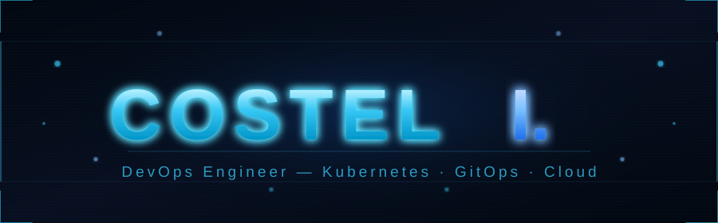

<div align="center">



<br/>

<a href="mailto:iacobcostel03@gmail.com">
  
</a>
<a href="https://github.com/Costel03?tab=repositories">
  
</a>
<a href="https://github.com/Costel03/Costel.I-UTM-Info-ID">
  
</a>


</div>

---

## 🧑‍💻 About Me

```yaml
name:      "Costel I."
location:  "Bucharest, RO"
education: "UTM — Informatica ID"
role:      "DevOps Engineer"
focus:
  - "Kubernetes & GitOps"
  - "Infrastructure as Code"
  - "CI/CD pipelines"
  - "Observability & secrets management"
currently_learning:
  - "CKA — Certified Kubernetes Administrator"
  - "Platform engineering patterns"
  - "Terraform & AWS at scale"
fun_fact:  "I automate everything — including my free time 🤖"
```

---

## 🧪 What I'm Building

A self-hosted Kubernetes homelab, split the way a real platform is:

| Layer | Repo | What lives there |
|---|---|---|
| **Bootstrap** | [homelab-cluster](https://github.com/Costel03/homelab-cluster) | VirtualBox VMs + kubeadm, MetalLB and Argo CD — the pieces GitOps cannot install for itself |
| **GitOps** | [homelab-gitops](https://github.com/Costel03/homelab-gitops) | Everything Argo CD syncs: ingress, monitoring, Vault, ESO, cert-manager — one directory per tool |
| **Cloud** | [aws-kubernetes-automation](https://github.com/Costel03/aws-kubernetes-automation) | The same cluster story on AWS, with Terraform + Ansible |
| **Config mgmt** | [Ansible-demo](https://github.com/Costel03/Ansible-demo) | LAMP + WordPress + NFS across four Vagrant VMs |

Not everything lives on GitHub. At work I built an **RKE2** cluster from scratch with **mixed Linux and Windows node pools** — Windows workers rule out a default install: they need their own container runtime, a CNI that supports them, and per-OS scheduling so workloads land on the right nodes.

And a teaching tool I wrote for myself:

**[`linux-curs-interactiv.sh`](https://github.com/Costel03/Costel.I-UTM-Info-ID/blob/Anul-II/Anul%20I/Semestrul%20II/Sisteme%20de%20operare/Teme/linux-curs-interactiv.sh)** — an interactive Bash script for practising Linux commands, built on the **InfoAcademy Linux** course (chapters 3–8, 12, 13). Menu-driven: each chapter gives the theory, then you run the commands yourself and see the output framed with its exit code. Covers the filesystem, users and permissions, processes and signals, shell scripting, package management, networking, Postfix and chrony.

---

## 🛠️ Tech Stack

| | |
|---|---|
| **Cloud** |     |
| **Containers & Orchestration** |        |
| **GitOps & CI/CD** |     |
| **Infrastructure as Code** |      |
| **Observability** |    |
| **Secrets & Certificates** |    |
| **Registries & Artifacts** |     |
| **OS & Scripting** |        |

**Day-to-day**


**Familiar with** — used, but not my strongest ground


-4A5568?style=flat-square&logo=splunk&logoColor=white)


---

## 📌 Featured Projects

<div align="center">

[](https://github.com/Costel03/homelab-cluster)
[](https://github.com/Costel03/homelab-gitops)

[](https://github.com/Costel03/aws-kubernetes-automation)
[](https://github.com/Costel03/Ansible-demo)

[](https://github.com/Costel03/Costel.I-UTM-Info-ID)

</div>

---

## 📊 GitHub Stats

<div align="center">


</div>

---

<div align="center">

*"The best infrastructure is the one you never have to think about."*

**Thanks for stopping by — feel free to explore my repos and reach out! 🚀**

</div>
